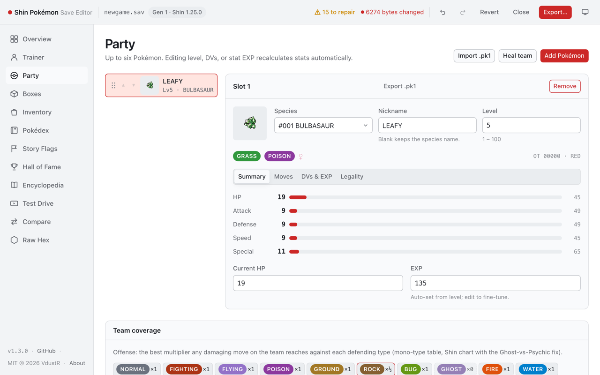
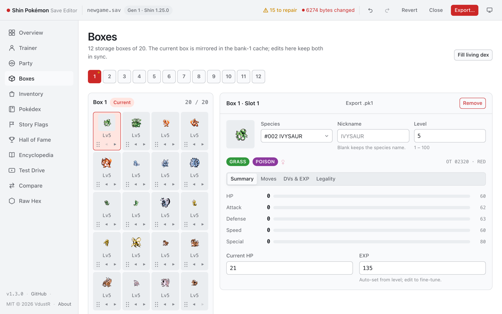
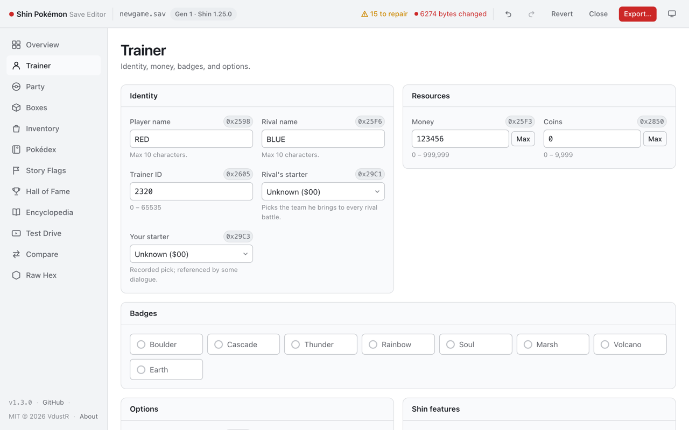
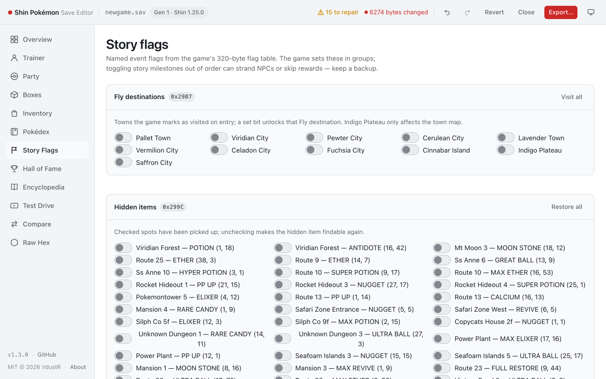
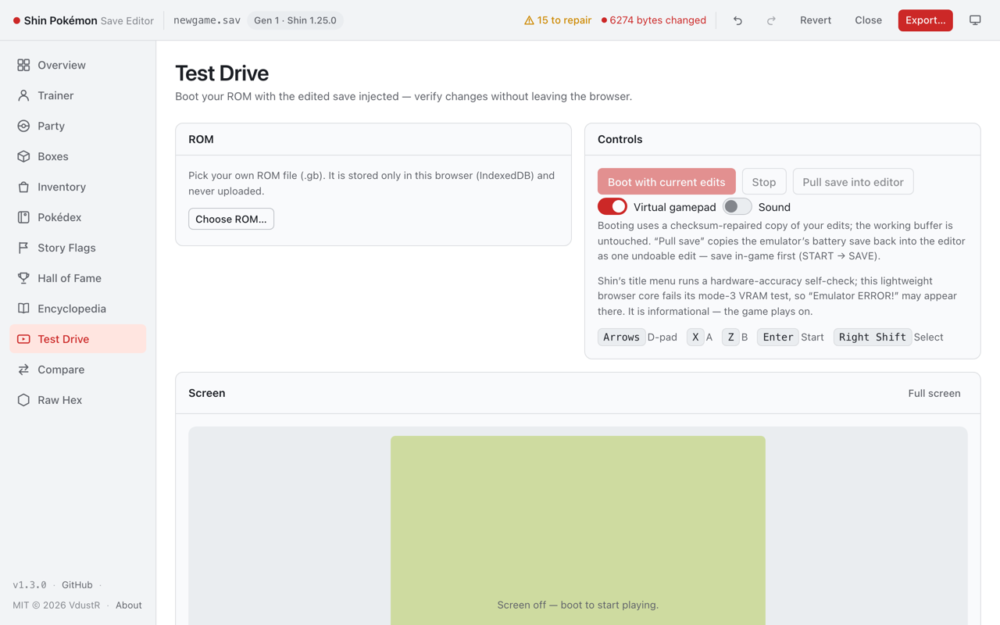
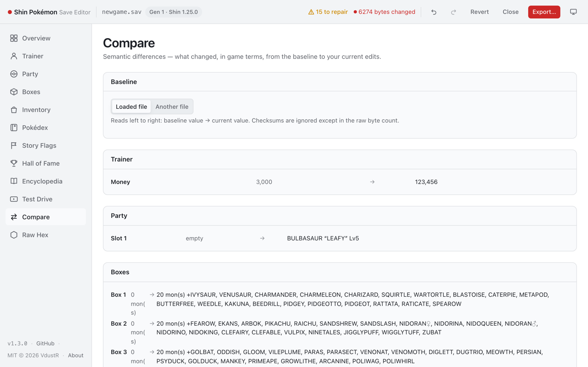
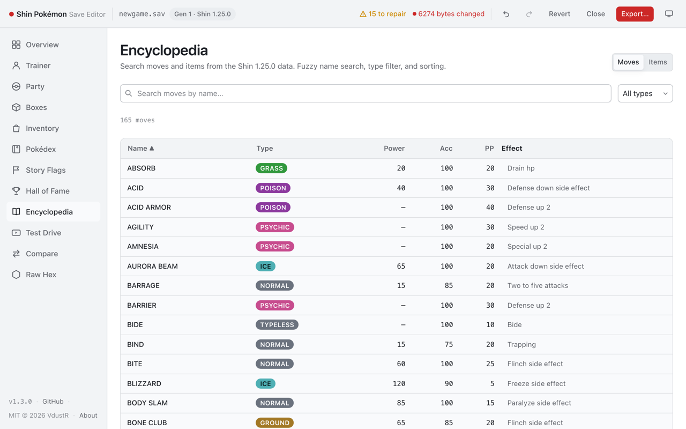
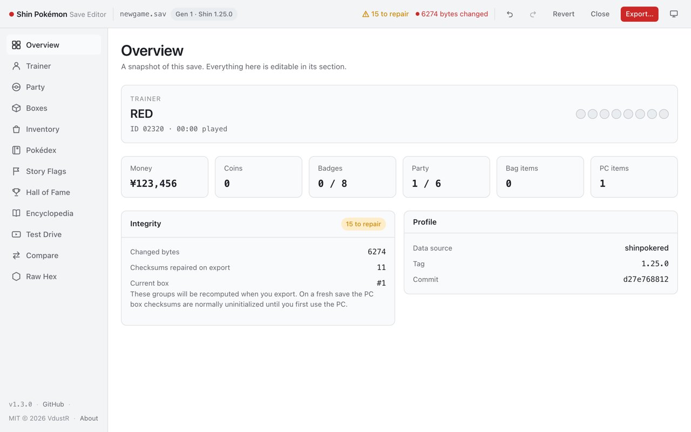

# Shin Pokémon Save Editor

A local-first, offline-capable web save editor for the
[Shin Pokémon](https://github.com/jojobear13/shinpokered) series
(Red, Blue, and the Green/JP-styled builds — they share one save layout)
and vanilla Gen 1 Red/Blue battery saves (`.sav` / `.srm`).

**Live:** <https://vdustr.dev/shinpokered-save-editor/>

Your save file never leaves the browser: no upload, no account, no backend.

## Features

Everything runs on the parsed 32 KiB battery save with a byte-for-byte
round-trip guarantee: exporting without edits reproduces the original file
exactly, and checksums (main data + per-bank box checksums) are validated and
repaired only where your edits made them stale.

| Page | What you can do |
|------|-----------------|
| **Overview** | File recognition verdict, checksum status, quick stats. |
| **Trainer** | Names, trainer ID, money/coins, badges, play time, options (with in-game polarity explained), both starters, map position (softlock rescue), win streak, and the Shin feature flags (female trainer, 60 fps, obedience cap, Nuzlocke, GBC colors, randomizer seed, caught/gender indicators). |
| **Party** | Full mon editor: species/nickname/level, moves with PP & PP Ups, DVs and stat EXP with live stat bars, one-click Max, drag/keyboard reordering, **legality badges** per slot, a **Legality report** tab per mon, **team type coverage** (Shin chart, Ghost→Psychic ×2 included), **Heal team**, and **.pk1 import/export** (PKHeX-compatible). |
| **Boxes** | All 12 boxes plus the current-box cache kept in sync like the game's own PC, box switching, reordering, .pk1 import/export, and a **living-dex filler** (one of every missing species, dex marked, first-box-switch safe). |
| **Inventory** | Bag and PC items with quantities, the game's own sort order, search pickers. |
| **Pokédex** | Seen/owned toggles per species. |
| **Story Flags** | 500+ named event flags with search, visited towns (Fly unlocks), hidden items/coins, missable item balls. |
| **Hall of Fame** | View and clear recorded teams; win-count handling. |
| **Encyclopedia** | Searchable move/item/species reference with type filters and legality info. |
| **Test Drive** | Boot **your own ROM** (stored only in IndexedDB) with your edits injected as battery SRAM — playable in-browser with keyboard or an on-screen **virtual gamepad** on touch devices, fullscreen mode, and **in-game save detection** that offers to pull the game's save back into the editor. |
| **Compare** | Semantic diff against the loaded file or any other save — changes described in game terms (money, badges, party slots, box contents, flags), not byte offsets. |
| **Raw Hex** | Full hex view with edit highlighting and jump-from-field links. |

Plus: **undo/redo everywhere** (Ctrl/⌘Z, capped history of 200 snapshots),
installable PWA with full offline support and an in-app update prompt,
responsive layout, automatic light/dark theme.

Game data (base stats, moves, learnsets, items, event flags, type chart, maps)
is generated from the
[shinpokered](https://github.com/jojobear13/shinpokered) source at tag
`1.25.0` — not hand-copied.

## Screenshots

| | |
|---|---|
|  |  |
|  |  |
|  |  |
|  |  |

## Development

```bash
pnpm install
pnpm gen:sprites  # download Gen 1 sprites into public/sprites (once; needs network)
pnpm dev          # dev server
pnpm test         # unit tests (vitest)
pnpm e2e          # browser e2e tests (playwright)
pnpm build        # production build (also regenerates the PWA service worker)
```

Sprites are not committed (they are © Nintendo/Creatures/GAME FREAK). Run
`pnpm gen:sprites` once; the PWA then precaches them for offline use. App icons
are original artwork and are committed, but can be regenerated with
`pnpm gen:icons`.

Game data is generated from the shinpokered source:

```bash
pnpm gen:data  # regenerate src/gen/gamedata.json (clones the pinned 1.25.0 tag)
```

See [DESIGN.md](DESIGN.md) for the design system and architecture notes.

## Testing & verification

The correctness strategy has four layers, from cheapest to strongest:

1. **Unit tests** (`pnpm test`) — checksum vectors, Gen 1 text/BCD codecs,
   Pokémon record round-trips, stat/EXP formulas, and field accessors.
2. **Real fixture** — `tests/fixtures/newgame.sav` is a genuine battery save
   produced by scripting the game's intro in a headless emulator
   (`SHINPOKERED_ROM=… pnpm make:fixture`). The suite asserts it parses and
   round-trips byte-for-byte.
3. **Browser e2e** (`pnpm e2e`) — loads the fixture, edits it, exports, and
   asserts the downloaded bytes: correct field values, a valid main checksum,
   and no unrelated bytes changed.
4. **Emulator smoke test** (`SHINPOKERED_ROM=… pnpm smoke`) — the release gate.
   Edits a save through the real save-core, boots the ROM with it, chooses
   CONTINUE, reaches the overworld, and asserts the game's own WRAM reflects the
   edits. This proves exported saves are loadable by the game, not merely
   well-formed. It is skipped when `SHINPOKERED_ROM` is unset.

## Credits

- Save structure and game data derived from
  [jojobear13/shinpokered](https://github.com/jojobear13/shinpokered) and the
  [pret/pokered](https://github.com/pret/pokered) disassembly.
- Gen 1 save layout cross-referenced with
  [Bulbapedia: Save data structure (Generation I)](https://bulbapedia.bulbagarden.net/wiki/Save_data_structure_(Generation_I)).
- This project does not distribute ROMs. Pokémon is © Nintendo / Creatures
  Inc. / GAME FREAK inc. This is an unofficial fan tool.

## License

[MIT](LICENSE) © 2026 VdustR (ViPro)
